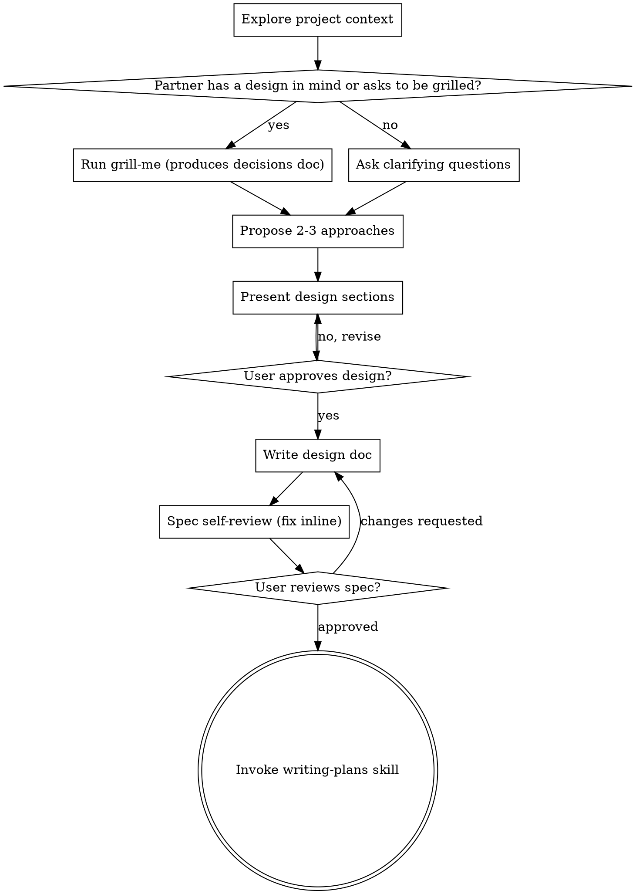

# Brainstorming Ideas Into Designs

## Overview

Help turn ideas into fully formed designs and specs through natural collaborative dialogue.

Start by understanding the current project context, then ask questions one at a time to refine the idea. Once you understand what you're building, present the design in small sections (200-300 words), checking after each section whether it looks right so far.

<HARD-GATE>
Do NOT invoke any implementation skill, write any code, scaffold any project, or take any implementation action until you have presented a design and the user has approved it. This applies to EVERY project regardless of perceived simplicity.
</HARD-GATE>

**You MUST NOT call `EnterPlanMode` or `ExitPlanMode` during this skill.** This skill operates in normal mode. Plan mode restricts Write/Edit tools and has no clean exit. Use the writing-plans skill for structured planning instead.

## Show, Then Ask

The question box (AskUserQuestion) displays only a short question and option labels — it cannot carry content. Any content a question refers to MUST be visible as normal message text in the same message as the question:

- Section approval → print the full section text, then ask
- Revised section approval → re-print the full revised section, never just a summary of what changed
- Approach choice → print the approaches with trade-offs, then ask
- Spec or file review → print the file path, then ask

<HARD-GATE>
Required order for EVERY confirmation, no exceptions: (1) write the full section/approach/content as normal message text, (2) in that SAME message, immediately after the text, call AskUserQuestion. Never call AskUserQuestion first, never call it in a message whose text does not already contain the full content it asks about.

Before every AskUserQuestion call, self-check: "Is the complete text this question refers to printed above, in this same message?" If no — or if you are asking about a revision and only the diff/summary is printed, not the full revised text — STOP and print it first. A confirmation question with no visible content preceding it is a defect, not a shortcut.
</HARD-GATE>

No exceptions:
- "The user already read it last turn" — they read the old version. Show the current one.
- "Keeping output minimal" — minimal never means asking about invisible content.
- "The option descriptions cover it" — option labels are answers, not content.

Never ask "does this look right?" about something not visible in your current message.

## Anti-Pattern: "This Is Too Simple To Need A Design"

Every project goes through this process. A todo list, a single-function utility, a config change — all of them. "Simple" projects are where unexamined assumptions cause the most wasted work. The design can be short (a few sentences for truly simple projects), but you MUST present it and get approval.

## Checklist

You MUST create a task for each of these items and complete them in order:

1. **Explore project context** — check files, docs, recent commits
2. **Ask clarifying questions** — one at a time, understand purpose/constraints/success criteria (or run the optional grill session instead — see "Optional: Grill Session First")
3. **Propose 2-3 approaches** — with trade-offs and your recommendation
4. **Present design** — in sections scaled to their complexity, get user approval after each section
5. **Write design doc** — save to `thoughts/shared/plans/<domain>/YYYY-MM-DD-<topic>-design.md`
6. **Spec self-review** — run the inline self-review checklist (placeholder scan, internal consistency, scope, ambiguity/coverage), fix issues inline
7. **User reviews written spec** — ask user to review the spec file before proceeding
8. **Transition to implementation** — invoke writing-plans skill to create implementation plan

## Process Flow

**The terminal state is invoking writing-plans.** Do NOT invoke any other implementation skill after brainstorming. The ONLY skill you invoke next is writing-plans.

## Optional: Grill Session First

If your partner already has a design in their head — or asks to be grilled — invoke the grill-me skill (REQUIRED SUB-SKILL: grill-me) in place of the clarifying-questions step. The grill session interrogates and stress-tests their design and always produces a decisions document. Resume here at "Propose 2-3 approaches", building on that document: never re-ask decisions the grill resolved; explore approaches only for what it left open. All later steps (design sections, spec doc, self-review, user gates) still apply.

## The Process

**Understanding the idea:**
- Check out the current project state first: check files, docs, and recent commits
- Ask questions one at a time to refine the idea
- Prefer multiple choice questions when possible, but open-ended is fine too
- Only one question per message - if a topic needs more exploration, break it into multiple questions
- Focus on understanding: purpose, constraints, success criteria
- Before asking detailed questions, assess scope: if the request describes multiple independent subsystems, flag this immediately. Don't spend questions refining details of a project that needs to be decomposed first.
- If the project is too large for a single spec, help the user decompose into sub-projects: what are the independent pieces, how do they relate, what order should they be built? Then brainstorm the first sub-project through the normal design flow.

**Exploring approaches:**
- Propose 2-3 different approaches with trade-offs
- Present options conversationally with your recommendation and reasoning
- Lead with your recommended option and explain why

**Presenting the design:**
- Once you believe you understand what you're building, present the design
- Break it into sections of 200-300 words
- Print the section's full text as message text FIRST, then ask whether it looks right so far — in the same message, never a bare question (see Show, Then Ask hard gate)
- After a revision, re-print the full revised section before asking again
- Cover: architecture, components, data flow, error handling, testing
- Be ready to go back and clarify if something doesn't make sense

**Design for isolation and clarity:**
- Break the system into smaller units that each have one clear purpose, communicate through well-defined interfaces, and can be understood and tested independently
- For each unit, you should be able to answer: what does it do, how do you use it, and what does it depend on?
- Smaller, well-bounded units are also easier for you to work with — you reason better about code you can hold in context at once, and your edits are more reliable when files are focused

## After the Design

**Documentation:**
- Determine the domain from the task context (e.g., accrual, KPI, project-management, etc.). If unclear, ask the user.
- Write the validated design to `thoughts/shared/plans/<domain>/YYYY-MM-DD-<topic>-design.md`
- Use elements-of-style:writing-clearly-and-concisely skill if available

**Spec Self-Review:**
After writing the design doc, look at it with fresh eyes — a checklist you run inline, not a subagent dispatch:
1. **Placeholder scan:** any "TBD", "TODO", incomplete sections, or vague requirements? Fix them.
2. **Internal consistency:** do any sections contradict each other? Does the architecture match the feature descriptions?
3. **Scope vs. requirements:** is this focused enough for a single implementation plan, or does it need decomposition?
4. **Ambiguity/coverage:** could any requirement be read two ways? Pick one and make it explicit. Is every requirement covered?

Fix any issues inline. No need to re-review — just fix and move on.

**User Review Gate:**
After the spec self-review, ask the user to review the written spec before proceeding:
> "Spec written to `<path>`. Please review and let me know if you want changes before we move to implementation planning."
Wait for user response. Only proceed once the user approves.

**Implementation (if continuing):**
- Ask: "Ready to set up for implementation?"
- Use writing-plans to create detailed implementation plan

## Key Principles

- **One question at a time** - Don't overwhelm with multiple questions
- **Show, then ask** - Content a question refers to must be visible in the same message
- **Multiple choice preferred** - Easier to answer than open-ended when possible
- **YAGNI ruthlessly** - Remove unnecessary features from all designs
- **Explore alternatives** - Always propose 2-3 approaches before settling
- **Incremental validation** - Present design in sections, validate each
- **Be flexible** - Go back and clarify when something doesn't make sense
