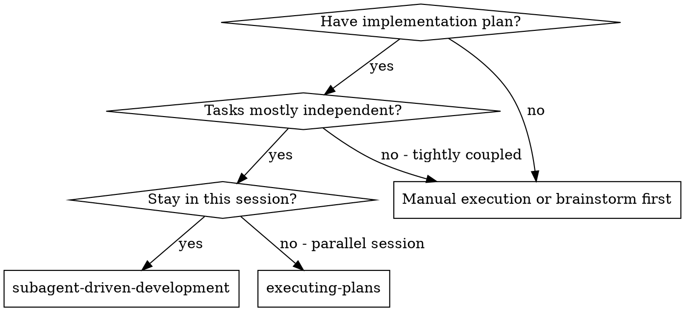
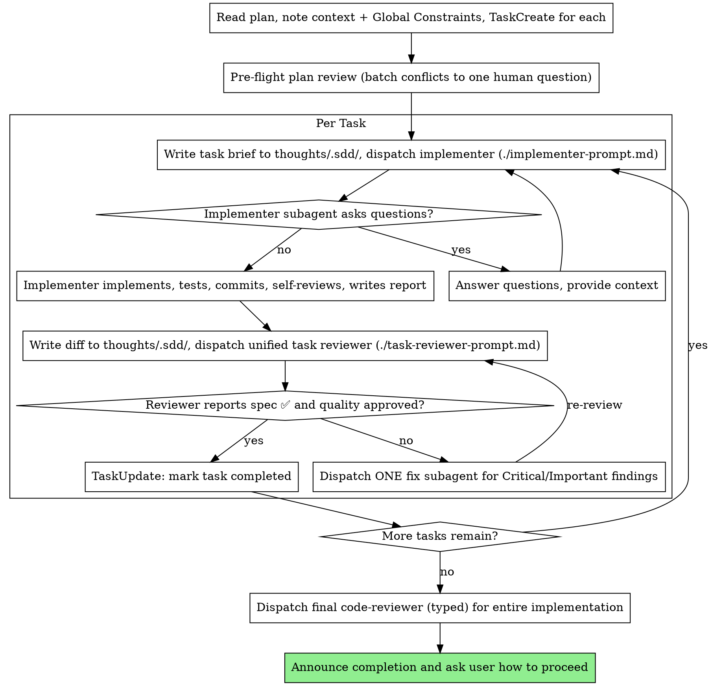

**You MUST NOT call `EnterPlanMode` or `ExitPlanMode` during this skill.** This skill operates in normal mode. Plan mode restricts Write/Edit tools and has no clean exit.

# Subagent-Driven Development

Execute a plan by dispatching a fresh subagent per task, a unified review after each (one reviewer returns both a spec-compliance and a code-quality verdict), and a typed whole-implementation review at the end.

**Core principle:** Fresh subagent per task + unified per-task review (spec + quality in one pass) + typed final review = high quality, fast iteration

**Why subagents:** You delegate tasks to specialized agents with isolated context. By precisely crafting their instructions and context, you ensure they stay focused and succeed at their task. They should never inherit your session's context or history — you construct exactly what they need. This also preserves your own context for coordination work.

## When to Use



**vs. Executing Plans (parallel session):**
- Same session (no context switch)
- Fresh subagent per task (no context pollution)
- Unified review after each task: one reviewer returns spec-compliance and code-quality verdicts
- Faster iteration (no human-in-loop between tasks)

## The Process



## Pre-Flight Plan Review

Before dispatching Task 1 — right after TaskCreate — scan the plan once for conflicts:

- tasks that contradict each other or the plan's Global Constraints
- anything the plan explicitly mandates that the review rubric would treat as a defect (a test that asserts nothing, verbatim duplication of a logic block)

Present everything you find to your human partner as ONE batched question — each finding beside the plan text that mandates it, asking which governs — before execution begins, not one interrupt per discovery mid-plan. If the scan is clean, proceed without comment. This is a one-time gate: ongoing plan-vs-reality discrepancies are handled by the Deviation Rules below and caught by the per-task review loop.

## Model Selection

Use the least powerful model that can handle each role to conserve cost and increase speed.

**Mechanical implementation tasks** (isolated functions, clear specs, 1-2 files): use a fast, cheap model. Most implementation tasks are mechanical when the plan is well-specified.

**Integration and judgment tasks** (multi-file coordination, pattern matching, debugging): use a standard model.

**Architecture, design, and review tasks**: use the most capable available model. The final whole-implementation review is one of these — dispatch it on the most capable model, not whatever the session defaults to.

**Always specify the model explicitly when dispatching a subagent.** An omitted model silently inherits your session's model — often the most capable and most expensive — which defeats this whole section.

**Turn count beats token price.** Wall-clock and context cost scale with how many turns a subagent takes, and the cheapest models routinely take 2-3× the turns on multi-step work — costing more overall. Use a mid-tier model as the floor for reviewers and for implementers working from prose. When the task's plan text contains the complete code to write, the implementer's job is transcription plus testing — use the cheapest tier. Single-file mechanical fixes also take the cheapest tier.

**Task complexity signals:**
- Touches 1-2 files with a complete spec → cheap model
- Touches multiple files with integration concerns → standard model
- Requires design judgment or broad codebase understanding → most capable model

## Reviewer Guardrails

When you fill in the task-reviewer prompt:

- **Don't pre-judge findings.** Never instruct a reviewer to ignore or downgrade a specific issue. If you think something would be a false positive, let the reviewer raise it and adjudicate in the review loop. If your prompt contains "do not flag", "at most Minor", or "the plan chose it" — stop, you are pre-judging to skip a loop.
- **Global Constraints are the reviewer's attention lens.** Copy the binding requirements verbatim from the plan's Global Constraints section (or the spec) into the prompt: exact values, formats, and stated relationships between components ("same layout as X", "matches Y"). The template already carries the process rules (YAGNI, test hygiene, review method) — the constraints block is for what THIS project's spec demands.
- **Never paste prior-task history.** A dispatch describes one task, not the session's story. A fresh subagent needs its task brief, the interfaces it touches, and the global constraints — nothing else. Do not paste "state after Tasks 1-3" summaries.
- **A plan-mandated finding is the human's call.** If a finding conflicts with what the plan's text requires, present the finding and the plan text and ask which governs — don't dismiss it because the plan mandates it, and don't dispatch a fix that contradicts the plan without asking.
- **Final review: ONE fix subagent.** If the final whole-implementation review returns findings, dispatch ONE fix subagent with the complete findings list — not one fixer per finding. Per-finding fixers each rebuild context and re-run suites.

## File Handoffs

Everything you paste into a dispatch prompt — and everything a subagent prints back — stays resident in your context for the rest of the session and is re-read on every later turn. Hand artifacts over as files under `thoughts/.sdd/` (create the directory if needed; it is scratch):

- **Task brief:** before dispatching an implementer, write the task's full text from the plan to `thoughts/.sdd/task-N-brief.md`. The dispatch prompt then contains only: (1) one line on where this task fits in the project; (2) the brief path, introduced as "read this first — it is your requirements, with the exact values to use verbatim"; (3) interfaces and decisions from earlier tasks that the brief cannot know; (4) your resolution of any ambiguity you noticed in the brief; (5) the report-file path. Exact values (numbers, magic strings, signatures, test cases) appear only in the brief.
- **Report file:** the implementer writes its full report to `thoughts/.sdd/task-N-report.md` and returns only status, commits, a one-line test summary, and concerns.
- **Review package:** before dispatching the reviewer, write the task's diff to `thoughts/.sdd/task-N-review.md` — the commit list, `git diff --stat`, and `git diff -U10` for the recorded BASE..HEAD range. Use the BASE you recorded before dispatching the implementer, never `HEAD~1` (which drops all but the last commit of a multi-commit task).
- **Reviewer inputs:** the task reviewer gets three paths — the brief, the report, and the review package — plus the global constraints that bind the task.
- Fix dispatches append their fix report (with test results) to the same report file; re-reviews read the updated file.

No helper scripts — write these files with your normal tools (Write for the brief, a shell redirect for the diff). The point is only that bulk text moves as files, not inline paste.

## Handling Implementer Status

Implementer subagents report one of four statuses. Handle each appropriately:

**DONE:** Write the task's diff to `thoughts/.sdd/task-N-review.md` (see File Handoffs), then dispatch the unified task reviewer with the brief, report, and diff paths plus the global constraints.

**DONE_WITH_CONCERNS:** The implementer completed the work but flagged doubts. Read the concerns before proceeding. If the concerns are about correctness or scope, address them before review. If they're observations (e.g., "this file is getting large"), note them and proceed to review.

**NEEDS_CONTEXT:** The implementer needs information that wasn't provided. Provide the missing context and re-dispatch.

**BLOCKED:** The implementer cannot complete the task. Assess the blocker:
1. If it's a context problem, provide more context and re-dispatch with the same model
2. If the task requires more reasoning, re-dispatch with a more capable model
3. If the task is too large, break it into smaller pieces
4. If the plan itself is wrong, escalate to the human

**Never** ignore an escalation or force the same model to retry without changes. If the implementer said it's stuck, something needs to change.

## After All Tasks Complete

After the final code reviewer approves, announce completion and ask the user how to proceed.

## Prompt Templates

- `./implementer-prompt.md` - Dispatch implementer subagent
- `./task-reviewer-prompt.md` - Dispatch the unified task reviewer (spec compliance + code quality in one pass)
- Final whole-implementation review: the typed `code-reviewer` agent, via `requesting-code-review`

## Example Workflow

```
You: I'm using Subagent-Driven Development to execute this plan.

[Read plan file once: thoughts/shared/plans/<domain>/feature-plan.md]
[Note context + Global Constraints; TaskCreate for each task]
[Pre-flight plan review: scan for conflicts, batch any to one human question]

Task 1: Hook installation script

[Write thoughts/.sdd/task-1-brief.md from the plan]
[Dispatch implementer (explicit model) with brief path + report path + context]

Implementer: "Before I begin - should the hook be installed at user or system level?"
You: "User level (~/.config/hooks/)"
Implementer: "Got it. Implementing now..."
[Later] Implementer returns: DONE, commits abc1234..def5678, 5/5 passing,
  self-review found + fixed a missing --force flag; full report in task-1-report.md

[Write thoughts/.sdd/task-1-review.md with the BASE..HEAD diff]
[Dispatch unified task reviewer (explicit model) with brief + report + diff paths + global constraints]
Task reviewer: Spec ✅ - all requirements met, nothing extra.
  Strengths: good coverage, clean. Issues: none. Task quality: Approved.

[Mark Task 1 complete; record commits abc1234..def5678 in .tasks.json]

Task 2: Recovery modes

[Write brief; dispatch implementer (explicit model)]
Implementer: DONE, 8/8 passing; report written.

[Write diff; dispatch unified task reviewer]
Task reviewer:
  Spec ❌: Missing progress reporting ("report every 100 items"); Extra --json flag (not requested)
  Issues (Important): magic number 100
  Task quality: Needs fixes

[Dispatch ONE fix subagent with the complete findings list]
Fixer: removed --json, added progress reporting, extracted PROGRESS_INTERVAL; tests re-run, passing.

[Write updated diff; dispatch unified task reviewer again]
Task reviewer: Spec ✅. Task quality: Approved.

[Mark Task 2 complete]

...

[After all tasks: dispatch the typed final code-reviewer for the whole implementation]
Final reviewer: all requirements met, ready to merge

[Announce completion, ask user how to proceed]
```

## Advantages

**vs. Manual execution:**
- Subagents follow TDD naturally
- Fresh context per task (no confusion)
- Parallel-safe (subagents don't interfere)
- Subagent can ask questions (before AND during work)

**vs. Executing Plans:**
- Same session (no handoff)
- Continuous progress (no waiting)
- Review checkpoints automatic

**Efficiency gains:**
- Controller curates exactly what context is needed; bulk artifacts move as files under `thoughts/.sdd/`, not pasted text
- Subagent gets complete information upfront
- Questions surfaced before work begins (not after)

**Quality gates:**
- Self-review catches issues before handoff
- Unified task review carries two verdicts — spec compliance and code quality — in one pass
- Review loops ensure fixes actually work
- Spec compliance prevents over/under-building
- Code quality ensures implementation is well-built

**Cost:**
- More subagent invocations (implementer + one reviewer per task)
- Controller does more prep work (extracting all tasks upfront)
- Review loops add iterations
- But catches issues early (cheaper than debugging later)

## Red Flags

**Never:**
- Start implementation on main/master branch without explicit user consent
- Skip task review, or accept a report missing either verdict (spec compliance AND code quality are both required)
- Proceed with unfixed Critical/Important issues
- Dispatch multiple implementation subagents in parallel (conflicts)
- Make a subagent read the whole plan file — hand it its scoped task brief under `thoughts/.sdd/` instead (the brief is a subset, not the plan)
- Skip scene-setting context (subagent needs to understand where task fits)
- Ignore subagent questions (answer before letting them proceed)
- Accept "close enough" on spec compliance (reviewer found spec issues = not done)
- Skip review loops (reviewer found issues = fix = review again)
- Let implementer self-review replace actual review (both are needed)
- Tell a reviewer what not to flag, or pre-rate a finding's severity in the dispatch prompt ("treat it as Minor at most")
- Move to next task while the review has open Critical/Important issues
- Re-dispatch a task the ledger already marks complete — check `.tasks.json` and `git log` after any compaction or resume

**If subagent asks questions:**
- Answer clearly and completely
- Provide additional context if needed
- Don't rush them into implementation

**If reviewer finds issues:**
- Dispatch a fix subagent with the complete findings list
- Reviewer reviews again
- Repeat until approved
- Don't skip the re-review

**If subagent fails task:**
- Dispatch fix subagent with specific instructions
- Don't try to fix manually (context pollution)

## Deviation Rules

When an implementer encounters a discrepancy between the plan and reality, the response depends on whether the fix has implications beyond the current task.

### Auto-Fix (report in completion summary)

Local-impact fixes — just do them, report in Deviations section:

- **Mechanical correctness** — wrong import paths, typos, broken references, incorrect file locations
- **Defensive completeness** — missing error handling, input validation, null checks the plan didn't mention but correctness requires
- **Unblocking** — missing dependencies, type errors, broken tests from upstream changes, config adjustments

### Escalate (stop and ask orchestrator)

Cross-task-impact changes — stop, report, wait for decision:

- **Architectural alignment** — plan says library X but codebase already uses library Y
- **Structural changes** — new database tables/schemas, new service layers, new abstraction boundaries
- **Scope expansion** — anything that would affect other tasks, plans, or the broader architecture

### Judging Subagent Behavior

When reviewing an implementer's Deviations section:
- Every auto-fix should be local-impact only — if it ripples to other tasks, it should have been escalated
- The task reviewer verifies each auto-fix was justified (not scope creep)
- If an implementer escalated something that could have been auto-fixed, that's fine (conservative is OK)
- If an implementer auto-fixed something that should have been escalated, that's a review failure

## Task Persistence Sync

The `.tasks.json` ledger co-located with the plan is your recovery map — conversation memory does not survive compaction. Keep it current, and keep the JSON format (resuming-handoff depends on it).

After each task's review comes back clean and you `TaskUpdate` it to completed:

1. Read `<plan-path>.tasks.json`
2. Set the task's `"status"` to `"completed"`
3. Add the task's commit range as `"commits": "<base7>..<head7>"` (the 7-char SHAs before and after the task) — these commits exist in git even when your context no longer remembers creating them
4. Set `"lastUpdated"` to the current ISO timestamp
5. Write the file back

**On resume or after compaction:** reconcile `.tasks.json` against `git log --oneline` and trust them over your recollection. A task marked `"completed"` is DONE — never re-dispatch it. Re-dispatching completed tasks is the single most expensive recovery failure. Resume at the first task not marked complete.

## Integration

**Required workflow skills:**
- **writing-plans** - Creates the plan this skill executes
- **requesting-code-review** - Code review template for the final whole-implementation review

**Subagents should use:**
- **test-driven-development** - Subagents follow TDD for each task

**Alternative workflow:**
- **executing-plans** - Use for parallel session instead of same-session execution
